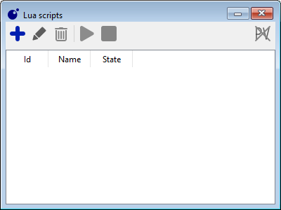
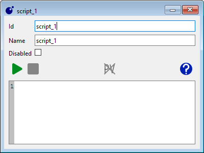

```markdown id="scripting_basics_de"
# Grundlagen des Skriptings

Traintastic enthält eine integrierte **Lua-Skript-Engine**.  
Skripte ermöglichen es, das Verhalten der Anlage zu erweitern, Aufgaben zu automatisieren und eigene Logik zu erstellen, die über die normale Benutzeroberfläche hinausgeht.

!!! tip
    Bei Fragen oder zur Inspiration lohnt sich ein Blick in die [Scripting-Kategorie im Community-Forum](https://discourse.traintastic.org/c/lua-scripting).

## Was ist Lua?

Lua ist eine leichtgewichtige, einfach zu erlernende Skriptsprache, die sowohl für Einsteiger als auch für erfahrene Entwickler geeignet ist.  
Sie wird von einem Team der **Pontifícia Universidade Católica do Rio de Janeiro (PUC-Rio)** in Brasilien entwickelt und ist weit verbreitet in Spielen, Embedded-Systemen und Automatisierung.

In Traintastic ist Lua direkt integriert, sodass keine zusätzliche Installation notwendig ist. Skripte können direkt mit der Modellanlage interagieren.

!!! note
    Skripting ist **optional**. Traintastic kann vollständig ohne Programmierung genutzt werden, aber Lua eröffnet erweiterte Möglichkeiten für Automatisierung und Logik.

## Arbeit mit Skripten

Zum Erstellen oder Bearbeiten von Skripten die Liste **Lua-Skripte** öffnen über:
**Objekte → Lua-Skripte** im Hauptmenü.



In diesem Dialog stehen folgende Funktionen zur Verfügung:

-  **Erstellen** eines neuen Skripts (nur im *Bearbeitungsmodus*).
-  **Bearbeiten** des ausgewählten Skripts im Editor.
-  **Löschen** eines Skripts (nur im *Bearbeitungsmodus*).
-  **Alle starten** – führt alle nicht deaktivierten Skripte aus.
-  **Alle stoppen** – beendet alle laufenden Skripte.

## Skript-Editor



- Ein Skript kann nur bearbeitet werden, wenn es **gestoppt** ist und sich im **Bearbeitungsmodus** befindet.
- Über die Option **Deaktiviert** kann verhindert werden, dass das Skript beim *Alle starten* ausgeführt wird.
- Tritt ein Fehler während der Ausführung auf, wird dieser im **Server-Log** protokolliert.

## Weitere Informationen

- Siehe die [Lua-Skript-Referenz](../appendix/lua/index.md) für verfügbare Funktionen und Objekte.
- Beispiele finden sich unter [Lua-Skript-Beispiele](../appendix/lua/examples.md).
- Austausch und Fragen im [Community-Forum (Scripting)](https://discourse.traintastic.org/c/lua-scripting).
- Offizielle Lua-Dokumentation: [lua.org](https://www.lua.org).
```
