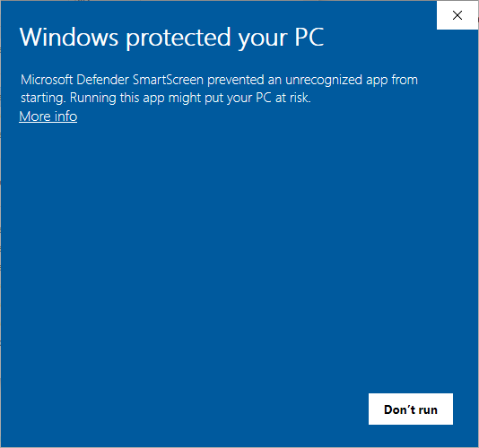
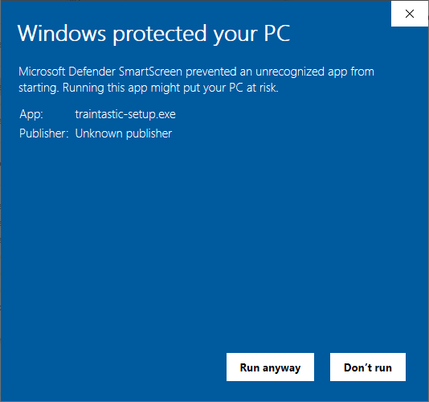
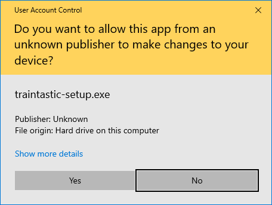
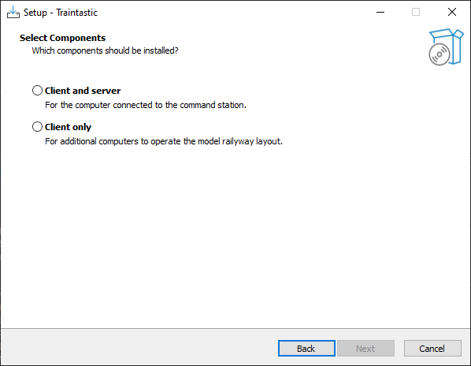
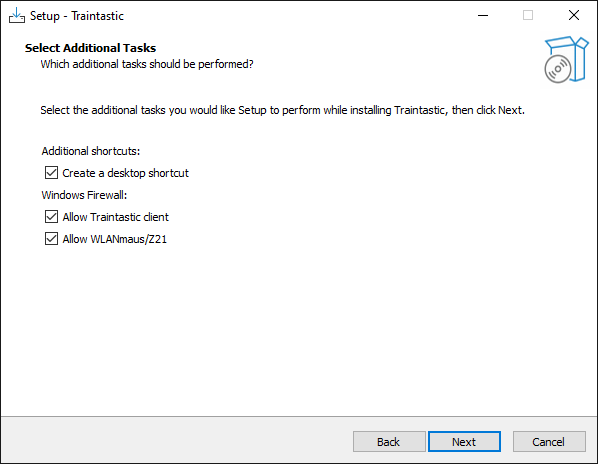
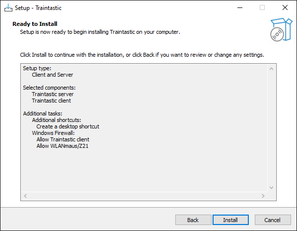

# Windows Installation

Die Installation von Traintastic unter Windows benötigt nur wenige Minuten. 
Du kannst das Installationsprogramm herunterladen und starten. Falls eine Meldung vom Windows Defender erscheint, musst Du erlauben, das das Installationsprogramm ausgeführt werden darf. 
Diee Anleitung zeigt Dir Schritt für Schritt mit Screenshots die Installation.

Lade die aktuellste Version herunter [traintastic.org/download](https://traintastic.org/download), starte das Installationsprogramm und folge den einzelnen Schritten.

---

## Schritt 1: Windows Defender

Windows könnte Dich warnen, das die Anwendung nicht sicher ist, da Traintastic keine von Microsoft signierte Anwendung ist.
Du kannst gesichert weitermachen, das ist normal bei nicht signierten Anwendungen. 
Klicke *More info* für die Anzeige von weiteren Informationen.

## Schritt 2: Windows Defender

Klicke *Run anyway* um den Installer zu starten.

## Schritt 3: Benutzerkontensteuerung

Klicke *Yes* um das Installationsprogramm zu starten.

## Schritt 4: Wähle Deine gewünschte Sprache

Wähle Deine Sprache für die Installation und klicke *OK*. 

Die gewählte Sprache wird auch für Traintastic verwendet, wenn das Programm startet. Die Sprache in Traintastic kann jederzeit umgestellt werden.

## Schritt 5: Lizenzvereinbarung

Wähle *I accept the agreement* und klicke *Next*.

## Schritt 6: Wähle die Komponenten zur Installation

Wähle den Installationstyp::

- **Client and Server** – wähle dies, wenn der Server und Client auf diesem Computer laufen sollen.
- **Client only** – wähle dies, wenn Du nur den Client installieren möchtest. Es muss ein Server im Netzwerk vorhanden sein!
Then click *Next*.

## Schritt 7: Desktop Verknüpfuingen und Firewall Regeln

- Wenn Du keine Desktop Verknüpfung möchtest, entferne den Haken.
- Firewall Regeln werden automatisch hinzugefügt, damit andere PCs im Netz mit dem Traintastic Server kommunizieren können. Das ist nicht erforderlich, wenn Du alles auf einem Computer installierst und keine grafische Oberfläche auf anderen Computern verwendest.

Dann klicke auf  *Next*.

## Schritt 8: Fertig für die Installation

Klicke auf *Install* um die Installation zu starten.

## Schritt 9: Installation abschließen

Klicke auf *Finish* um das Installationsprogramm zu beenden. Die Installation ist nun fertig.

---

Nach der Installation kannst Du hier weiter machen: [Die Schnellstart-Anleitungen](../quickstart/index.md).
