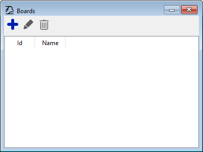
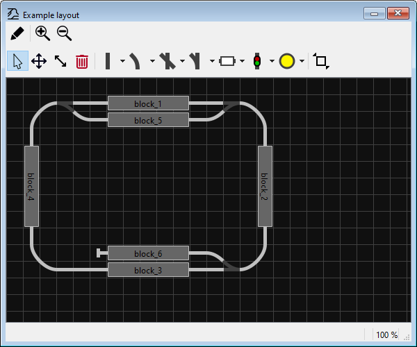

# Schnellstart: Grundlagen des Zeichnens

In Traintastic werden Schaltpläne auf einem **Board** gezeichnet.  
Ein Board ist eine Zeichenfläche, auf der Gleise, Weichen, Signale und andere Objekte platziert werden, um die reale Modellbahnanlage als Schema darzustellen.  
Es können mehrere Boards erstellt werden, zum Beispiel eines für die **Hauptanlage** und eines für den **Schattenbahnhof**.

## Schritt 1: Board-Liste öffnen

1. Sicherstellen, dass der **Bearbeitungsmodus** aktiv ist ( oben rechts).  
2. Die Board-Liste öffnen:
    - Über das Hauptmenü: **Objekte → Boards**
    - Oder über die -Schaltfläche in der Werkzeugleiste

## Schritt 2: Neues Board erstellen

1. In der Board-Liste auf die -Schaltfläche klicken.
2. Der **Board-Einrichtungsassistent** öffnet sich.  
   Aktuell wird nur ein **Name für das Board** abgefragt (z. B. *Hauptanlage* oder *Schattenbahnhof*).
3. Assistent abschließen, um das Board einzurichten.

Nun kann mit dem Zeichnen begonnen werden.

## Schritt 3: Kacheln platzieren und drehen

1. Eine **Kachel** aus der Werkzeugleiste auswählen (Gerade, Bogen, Weiche usw.).  
2. Auf das Board klicken, um sie zu platzieren.  
3. Zum **Drehen** vor dem Platzieren:
    - **Rechtsklick** — im Uhrzeigersinn drehen
    - ++shift++ + **Rechtsklick** — gegen den Uhrzeigersinn drehen

## Schritt 4: Kacheln verschieben

1. In der Werkzeugleiste  auswählen.
2. Auf die Kachel klicken, die verschoben werden soll.  
   Die Kachel folgt dem Mauszeiger.
3. Erneut klicken, um sie an der neuen Position abzulegen.
    - Drehen funktioniert wie beim Platzieren.
    - Zum Abbrechen ++esc++ drücken.

## Schritt 5: Kacheln skalieren

Einige Kacheln, z. B. Blöcke, können **in der Länge verändert** werden.

1. In der Werkzeugleiste  auswählen.
2. Die gewünschte Kachel anklicken.
3. Die Kante ziehen, um die Länge zu ändern.

## Schritt 6: Kacheln löschen

1. In der Werkzeugleiste  auswählen.
2. Auf die zu entfernende Kachel klicken.  
   Sie wird sofort gelöscht.

---

Mit diesen Grundlagen lässt sich eine Anlage Schritt für Schritt aufbauen und anpassen.

!!! tip
    Bei größeren Anlagen zuerst nur einen **kleinen Abschnitt** zeichnen.  
    Das erleichtert das Verständnis des Board-Editors erheblich.

Hier ein **einfaches Beispiel einer Anlage**:

Dieses Layout wird in den folgenden Kapiteln verwendet, um **Weichensteuerung**, **Blöcke und Sensoren** sowie **Signale** zu erklären.

Weiter: [Weichensteuerung](turnouts.md)