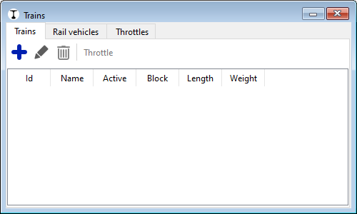
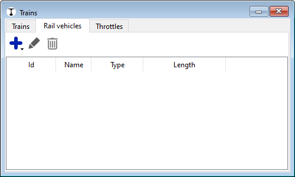
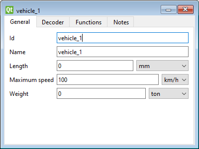
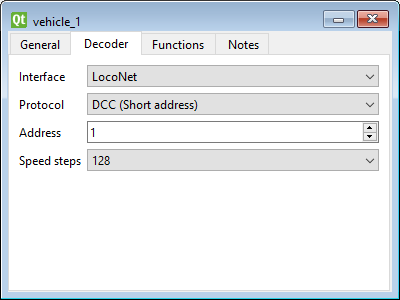
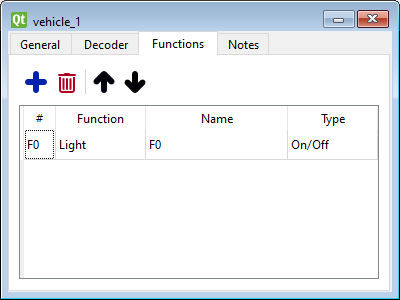
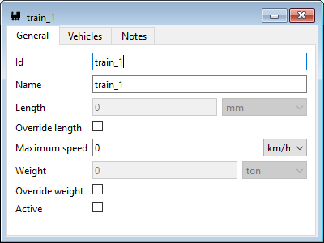
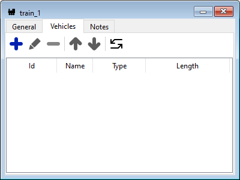
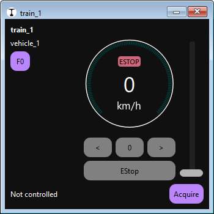
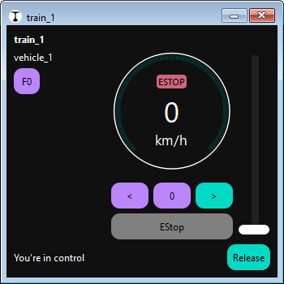

# Schnellstart: Zug hinzufügen und steuern

In Traintastic werden nicht direkt *Lokomotiven* gesteuert.  
Stattdessen werden **Züge** bedient.

Ein **Zug** ist eine Zusammenstellung von Fahrzeugen (Lokomotiven und Wagen).

- Ein Zug sollte **eine oder mehrere Lokomotiven** enthalten.
- Dieselbe Lokomotive oder derselbe Wagen kann in **mehreren Zügen** verwendet werden, aber immer nur in **einem Zug gleichzeitig aktiv** sein.
- Um einen Zug zu bedienen, muss er **aktiviert** werden. Die Aktivierung funktioniert nur, wenn keine seiner Lokomotiven oder Wagen bereits in einem anderen aktiven Zug verwendet werden.

Dieses Konzept ermöglicht eine flexible Wiederverwendung verschiedener Zugzusammenstellungen.

## Schritt 1: Zugliste öffnen

1. Sicherstellen, dass der **Bearbeitungsmodus** aktiv ist ( oben rechts).
2. Die Liste auf eine der folgenden Arten öffnen:
    - Über das Hauptmenü: **Objekte → Züge**
    - Oder über die **Zug-Schaltfläche** in der Werkzeugleiste

Der Dialog hat drei Reiter:

- **Züge** — Züge definieren und verwalten
- **Fahrzeuge** — Lokomotiven und Wagen definieren und verwalten
- **Fahrpulte** — Liste aktiver Fahrpulte zur Zugsteuerung

## Schritt 2: Lokomotive erstellen

1. Zum Reiter **Fahrzeuge** wechseln. \
    
2. Auf die -Schaltfläche klicken und **Lokomotive** auswählen. \
    
3. Lokomotivdaten eintragen:
    - **Name** — z. B. „BR 03“ oder „NS 2400“
    - **Höchstgeschwindigkeit** — z. B. 80 km/h
4. Zum Reiter **Decoder** wechseln. \
    
5. Decoder-Daten eintragen:
    - **Schnittstelle** — die Schnittstelle, die die Lok steuert (bei nur einer Schnittstelle automatisch gesetzt)
    - **Protokoll** — Decoder-Protokoll (DCC, Motorola, MFX usw.; abhängig von der Schnittstelle)
    - **Adresse** — Lokadresse
    - **Fahrstufen** — Anzahl der Fahrstufen (abhängig von Schnittstelle/Protokoll)
6. Zum Reiter **Funktionen** wechseln. \
    
7. Zusätzliche Funktionen können über die -Schaltfläche hinzugefügt werden. Mit Doppelklick lassen sich Funktionen bearbeiten. Felder:
    - **#** — Funktionsnummer: F0, F1 usw. (nur die Zahl eingeben)
    - **Funktion**
    - **Name** — Kurzbeschreibung der Funktion
    - **Typ**
8. Dialog schließen.

## Schritt 3: Zug erstellen

1. Zurück zum Reiter **Züge** wechseln.
2. Auf die -Schaltfläche klicken, um einen neuen Zug zu erstellen. \
    
3. Einen **Namen** für den Zug eingeben (z. B. „InterCity“ oder „Güterzug“).
4. Zum Reiter **Fahrzeuge** wechseln. \
    
5. Auf  klicken und die Lokomotive (optional auch Wagen) hinzufügen.
6. Dialog schließen.

Der Zug ist nun definiert, aber noch nicht aktiv.

## Schritt 4: Zug steuern

1. In den **Betriebsmodus** wechseln (Stift-Schalter deaktivieren).  
2. Auf der Werkzeugleiste die -Schaltfläche aktivieren, damit Zugbewegungen möglich sind.
3. Den Zug in der Liste doppelklicken, um ein Fahrpult zu öffnen. \
    
4. Auf **Übernehmen (Acquire)** klicken, um den Zug zu aktivieren und die Kontrolle über Geschwindigkeit und Richtung zu übernehmen (siehe Hinweis unten). \
    
5. Mit dem Regler die Geschwindigkeit einstellen — der Zug fährt nun.

!!! info "Zugsteuerung und Besitz"
    In Traintastic kann **nur ein Fahrpult gleichzeitig einen Zug steuern**.

    - *Acquire* übernimmt die Kontrolle über den Zug.
    - *Release* gibt die Kontrolle wieder frei, damit ein anderes Fahrpult übernehmen kann.
    - Wenn ein Zug bereits von einem anderen Fahrpult gesteuert wird, kann die Kontrolle dennoch übernommen („gestohlen“) werden.

    Dieses Besitzmodell verhindert Konflikte und stellt sicher, dass jeder Zug eindeutig gesteuert wird.

    *Not-Aus (E-Stop)* sowie *Funktionen (Licht, Sound usw.)* stehen **immer ohne Besitzübernahme** zur Verfügung.