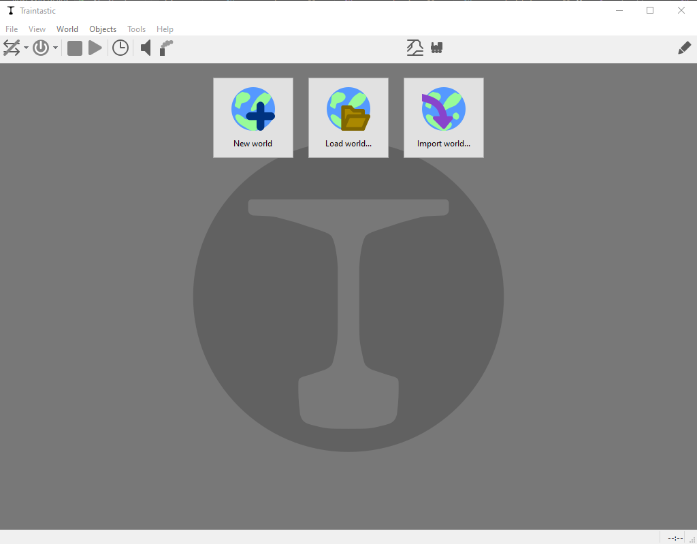
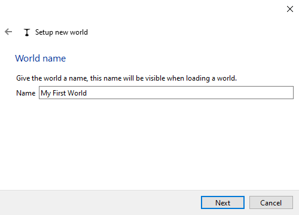
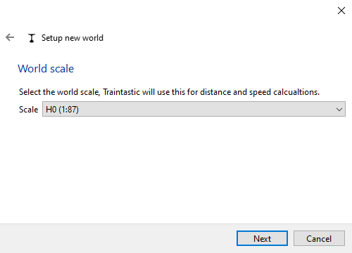
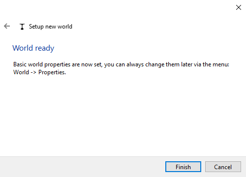

# Schnellstart: Erstelle Deine erste Welt 

In Traintastic ist eine **Welt** die Basis für das Layout Deiner Modellbahnanlage. Eine Welt ist eine Projektdatei und repräsentiert Deine Modellbahn inklusive Lokomotiven, Züge, Zubehör, Fahrstraßen und Automatisierung. Die Welt ist ein Abbild Deiner Modellbahnanlage, Dein kleines Universum.

## Schritt 1: Starten des Servers und Clients

1. Starte den **Server** auf Deinem Computer (oder einem Geräte wie dem Raspberry Pi).
2. Starte den **Client**. Der Client sucht und verbindet sich automatisch mit dem Server.

Wenn der Server keine Welt geladen hat, das ist normal nach einer neuen Installation, zeigt der Client drei Optionen an:

- *Neue Welt* – erstelle eine neue Welt mit dem Wizard
- *Welt laden* – öffne eine auf dem Server gespeicherte Welt 
- *Importiere Welt* – importiere die Projektdatei einer Welt

## Schritt 2: Erstelle eine neue Welt 

Klicke auf *Neue Welt* um den Wizard zu starten:

1. Gebe den **Namen** für Deine Welt ein (als Beispiel *Ferbach-Laubach*). \
    
2. Wähle den **Maßstab** (H0, N, Z, etc.). \
    
3. Beende den Wizard, um Deine neue, leere Welt zu erstellen. \
    

## Schritt 3: Bearbeitungs- und Betriebsmodi

Wenn eine neue Welt erstellt wurde, wird diese im **Bearbeiten Modus** geöffnet.
Du kannst zwischen den Modi mit dem  Button in der oberen rechten Ecke umschalten:

- **Bearbeitungsmodus** – Objekte oder Eigenschaften ändern und hinzufügen
- **Betriebsmodus** – Fahre Züge und schalte Weichen, Signale und Zubehör

Viele Eigenschaften können nur im Bearbeitungsmodus geändert werden. Dies schützt vor unbeabsichtigten Ändernungen während des Betriebes.

## Schritt 4: Speichern und teilen von Welten

- Welten werden immer auf dem **Server** im Standardordner gespeichert.
- Bei jedem Speichern einer Welt wird ein Backup erstellt.
- Um Deine Welt zu teilen (zum Beispiel im Forum oder für die Nutzung auf einem anderen Computer), benutze *Datei* -> *Welt exportieren*
  - Die exportierte Projektdatei kann später auf jedem Server importiert werden.

---

**Deine neue Welt ist nun bereit!**

Der nächste Schritt ist nun die [Verbindung mit Deiner Digitalzentrale](command-station.md), damit Traintastic Deine Modellbahn steuerun kann. 
